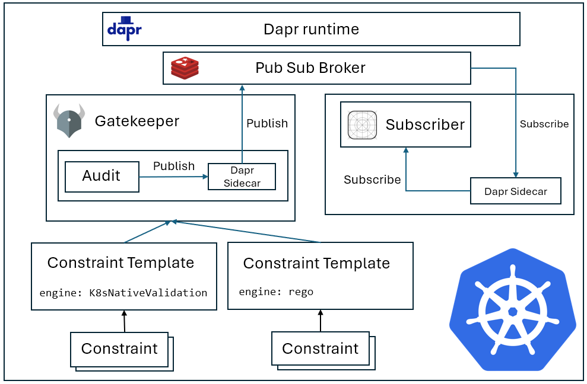

# Gatekeeper Demo for Kubecon NA 2023

This demo shows how to use Gatekeeper with both CEL and Rego-based policies, with constraint violations sent as events to a subscriber using Dapr.

## Prerequisites
- [Docker](https://docs.docker.com/engine/install/)
- [kind](https://kind.sigs.k8s.io/)
- [kubectl](https://kubernetes.io/docs/reference/kubectl/)
- [Helm](https://helm.sh/docs/intro/install/)

## Usage
`./demo.sh` to run the demo

## Architecture
